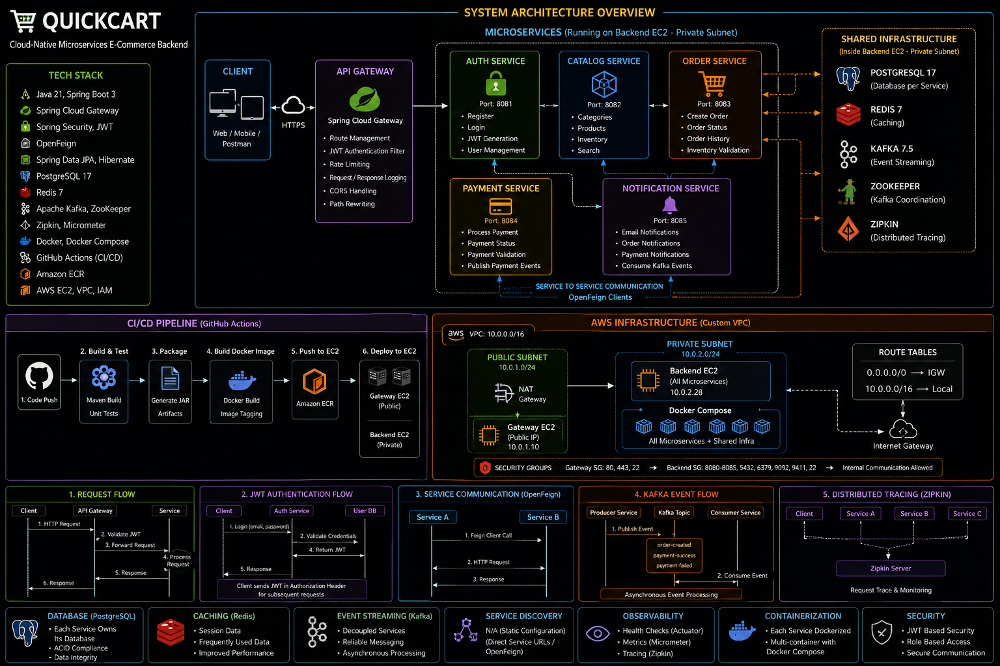

# 🛒 QuickCart - Cloud-Native Microservices E-Commerce Backend

<div align="center">

### Enterprise-Grade Microservices Architecture with Spring Boot • AWS • Docker • Kafka • Redis • CI/CD

---


</div>

---

# 📌 About QuickCart

QuickCart is a **Cloud-Native Microservices-based E-Commerce Backend** built using **Java 21**, **Spring Boot 3**, and **Spring Cloud** following modern backend engineering principles.

The project demonstrates how enterprise-scale backend systems are designed, developed, containerized, automated, and deployed on AWS using a production-oriented architecture.

Unlike a traditional CRUD application, QuickCart separates business capabilities into independently deployable microservices while integrating distributed caching, asynchronous messaging, centralized API routing, distributed tracing, and automated cloud deployment.

The project simulates a real-world backend system by implementing:

- Independent Microservices
- API Gateway
- JWT Authentication & Authorization
- Service-to-Service Communication
- Distributed Caching
- Event-Driven Communication
- Distributed Tracing
- Docker Containerization
- GitHub Actions CI/CD
- Amazon ECR
- AWS EC2 Deployment
- Custom AWS VPC Infrastructure

---

# ✨ Key Features

### 🔐 Authentication & Security

- User Registration
- User Login
- JWT Token Generation
- JWT Validation
- BCrypt Password Encryption
- Spring Security
- Route Protection
- Stateless Authentication

---

### 📦 Product Catalog

- Category Management
- Product Management
- Inventory Management
- Product Availability
- Product Search

---

### 🛒 Order Management

- Create Orders
- Order Processing
- Order History
- Inventory Validation
- Order Status Tracking

---

### 💳 Payment Processing

- Payment Service
- Payment Validation
- Payment Status
- Payment Event Publishing

---

### 🔔 Notification Service

- Kafka Consumer
- Event-Based Notifications
- Order Notifications
- Payment Notifications

---

### 🚪 API Gateway

- Centralized Request Routing
- JWT Authentication Filter
- Route Management
- Secure API Entry Point
- Service Isolation

---

### ⚡ Distributed System Features

- Redis Caching
- Kafka Messaging
- Distributed Tracing
- Service-to-Service Communication using OpenFeign

---

### ☁️ Cloud & DevOps

- Dockerized Microservices
- Docker Compose
- GitHub Actions CI/CD
- Amazon Elastic Container Registry (ECR)
- AWS EC2 Deployment
- Custom AWS VPC
- IAM Role Based Authentication

---

# 🚀 Technology Stack

## Backend

- Java 21
- Spring Boot 3
- Spring MVC
- Spring Data JPA
- Hibernate ORM
- Spring Security
- Spring Cloud Gateway
- Spring Boot Actuator
- Spring Validation
- Spring Cache
- OpenFeign Client
- Micrometer Tracing

---

## Authentication

- JWT Authentication
- JWT Authorization
- BCrypt Password Encoder
- Stateless Authentication

---

## Database

- PostgreSQL 17
- Hibernate ORM
- Spring Data JPA
- HikariCP Connection Pool

---

## Distributed Systems

- Redis
- Apache Kafka
- ZooKeeper
- Zipkin
- Micrometer

---

## Microservices

- Spring Cloud Gateway
- OpenFeign
- REST APIs
- DTO Pattern
- Global Exception Handling
- Layered Architecture

---

## DevOps

- Docker
- Docker Compose
- GitHub Actions
- Continuous Integration
- Continuous Deployment
- GitHub Artifacts
- Matrix Build Strategy

---

## AWS Cloud

- Amazon EC2
- Amazon ECR
- IAM
- IAM Roles
- Virtual Private Cloud (VPC)
- Public Subnets
- Private Subnets
- Internet Gateway
- Route Tables
- Security Groups

---

## Development Tools

- IntelliJ IDEA
- VS Code
- Maven
- Git
- GitHub
- Docker Desktop
- Postman
- AWS CLI

---

# 🏆 Engineering Concepts Demonstrated

This project demonstrates several real-world backend engineering concepts:

- Cloud-Native Microservices Architecture
- Independent Service Deployment
- API Gateway Pattern
- Layered Architecture
- Repository Pattern
- DTO Pattern
- Stateless JWT Authentication
- Service-to-Service Communication using OpenFeign
- Distributed Caching using Redis
- Event-Driven Architecture using Kafka
- Distributed Tracing using Zipkin
- Containerized Deployment with Docker
- Infrastructure Separation using Docker Compose
- CI/CD Pipeline using GitHub Actions
- Amazon ECR Image Management
- AWS EC2 Automated Deployment
- IAM Role Based Authentication
- Environment-Based Configuration
- Production-Oriented Deployment Strategy
- Fault Isolation Between Services
- Scalable Backend Architecture

- # 🏗️ System Architecture

QuickCart follows a **Cloud-Native Microservices Architecture**, where every business capability is developed as an independent Spring Boot application.

Each microservice owns its own business logic and communicates using either:

- **REST APIs** (Synchronous Communication)
- **OpenFeign Clients** (Service-to-Service Communication)
- **Apache Kafka** (Asynchronous Event-Driven Communication)

The entire application is containerized using Docker and deployed to AWS EC2 through a fully automated GitHub Actions CI/CD pipeline.

<p align="center">



</p>

---

# 🏛️ Architecture Overview

```
                Client Applications
         (Browser • Mobile • Postman)
                        │
                        ▼
               Spring Cloud Gateway
                        │
      ┌─────────────────┼──────────────────┐
      ▼                 ▼                  ▼
 Auth Service     Catalog Service     Order Service
                                          │
                                          ▼
                                 Payment Service
                                          │
                                          ▼
                              Notification Service

────────────────────────────────────────────────────

Shared Infrastructure

PostgreSQL
Redis
Kafka
ZooKeeper
Zipkin

────────────────────────────────────────────────────

Deployment

GitHub → GitHub Actions → Amazon ECR → AWS EC2
```

---

# 🔄 Request Lifecycle

Every client request follows the same processing pipeline.

```
Client

↓

API Gateway

↓

JWT Authentication

↓

Route Mapping

↓

Target Microservice

↓

Business Logic

↓

Database / Redis / Kafka

↓

Response

↓

Client
```

The Gateway acts as the single entry point for every incoming request.

---

# 🚪 API Gateway

The Gateway Service is responsible for:

- Centralized API Routing
- JWT Authentication
- Request Authorization
- Request Logging
- Cross-Origin Resource Sharing (CORS)
- Route Management
- Secure Entry Point to Microservices

All client requests first pass through the Gateway before reaching the target service.

---

# 🔐 Authentication Flow

Authentication is implemented using **Spring Security** and **JWT (JSON Web Token)**.

### Login Flow

```
User

↓

POST /api/auth/login

↓

Auth Service

↓

Validate Credentials

↓

Generate JWT Token

↓

Return JWT

↓

Client Stores Token

↓

Every Future Request

↓

Authorization Header

Bearer <JWT>

↓

Gateway JWT Filter

↓

Authenticated Request
```

Passwords are securely stored using **BCrypt Password Encoding**.

The application follows a **Stateless Authentication** mechanism.

---

# 🔗 Service-to-Service Communication

QuickCart uses **OpenFeign Clients** for synchronous communication between microservices.

### Why OpenFeign?

- Declarative REST Client
- Simplifies Service Calls
- Reduces Boilerplate Code
- Clean Integration with Spring Boot
- Easier Maintenance

Example Flow

```
Order Service

↓

OpenFeign

↓

Catalog Service

↓

Inventory Validation

↓

Response
```

OpenFeign is used only for synchronous service communication where an immediate response is required.

---

# 📨 Event-Driven Communication

QuickCart uses **Apache Kafka** for asynchronous communication.

Unlike REST communication, Kafka enables services to communicate without direct dependency.

### Order Event Flow

```
Order Service

↓

Publish Event

↓

Kafka

↓

Notification Service

↓

Send Notification
```

### Payment Event Flow

```
Payment Service

↓

Publish Event

↓

Kafka

↓

Notification Service

↓

Send Notification
```

Benefits:

- Loose Coupling
- High Scalability
- Asynchronous Processing
- Better Reliability

---

# ⚡ Redis Cache

Redis is used to reduce database access and improve response time.

Cache Flow

```
Client

↓

Gateway

↓

Catalog Service

↓

Redis

↓

Cache Hit

↓

Return Response

OR

↓

Cache Miss

↓

PostgreSQL

↓

Store in Redis

↓

Return Response
```

Advantages

- Faster API Response
- Reduced Database Load
- Better Scalability
- Improved Performance

---

# 📈 Logging & Monitoring

QuickCart includes centralized tracing using **Micrometer** and **Zipkin**.

Every request is traced across multiple microservices.

```
Gateway

↓

Auth

↓

Catalog

↓

Order

↓

Payment

↓

Notification

↓

Zipkin
```

The application also generates Docker container logs for every microservice, making debugging and troubleshooting easier during development and deployment.

---

# 🐳 Docker Architecture

Every microservice is packaged as an independent Docker image.

```
Docker Engine

├── Gateway Container
├── Auth Container
├── Catalog Container
├── Order Container
├── Payment Container
├── Notification Container
├── PostgreSQL Container
├── Redis Container
├── Kafka Container
├── ZooKeeper Container
└── Zipkin Container
```

Docker Compose is used to orchestrate all containers and provide a consistent local and production deployment environment.

# ☁️ AWS Cloud Infrastructure

QuickCart is deployed on **Amazon Web Services (AWS)** using a production-oriented infrastructure that separates application layers while following modern cloud deployment practices.

The deployment consists of:

- Custom Virtual Private Cloud (VPC)
- Public & Private Subnets
- Amazon EC2
- Amazon Elastic Container Registry (ECR)
- IAM Roles
- Security Groups
- Docker Compose
- GitHub Actions CI/CD

---

# 🌐 AWS Architecture

| Component | Purpose |
|-----------|---------|
| Amazon VPC | Isolated private network |
| Internet Gateway | Internet connectivity |
| Route Tables | Network routing |
| Public Subnets | Internet-facing resources |
| Private Subnets | Reserved for backend expansion |
| Gateway EC2 | API Gateway deployment |
| Backend EC2 | Microservices deployment |
| Security Groups | Firewall rules |
| IAM Role | Secure AWS authentication |
| Amazon ECR | Docker image registry |

---

# 🏗️ Infrastructure Layout

```

Internet

↓

Internet Gateway

↓

AWS VPC

├── Public Subnet A
│
│ Gateway EC2
│
│ Docker
│
│ Gateway Service
│
├── Public Subnet B
│
│ Reserved
│
├── Private Subnet A
│
│ Reserved for Future Expansion
│
└── Private Subnet B
Reserved for Future Expansion

```

Backend services are currently deployed on a dedicated EC2 instance while the VPC structure is designed to support future migration into private subnets without major architectural changes.

---

# 🔐 IAM & Security

QuickCart follows AWS security best practices by separating deployment credentials from application infrastructure.

## GitHub Actions

```

GitHub Actions

↓

AWS IAM User

↓

Amazon ECR

```

GitHub Actions authenticates using repository secrets to build and publish Docker images.

---

## EC2 Deployment

```

EC2 Instance

↓

IAM Role

↓

Amazon ECR

↓

docker pull

```

The EC2 instances authenticate using **IAM Roles**, eliminating the need to store AWS Access Keys on the servers.

---

# 🐳 Docker Deployment

Every Spring Boot microservice is packaged into an independent Docker image.

## Application Containers

| Container | Port |
|------------|------|
| Gateway | 8080 |
| Auth | 8081 |
| Catalog | 8082 |
| Order | 8083 |
| Payment | 8084 |
| Notification | 8085 |

---

## Infrastructure Containers

| Container | Purpose |
|------------|----------|
| PostgreSQL | Database |
| Redis | Cache |
| Kafka | Event Streaming |
| ZooKeeper | Kafka Coordination |
| Zipkin | Distributed Tracing |

---

# 📦 Amazon Elastic Container Registry (ECR)

Each microservice is stored as an independent Docker repository.

```

Amazon ECR

├── quickcart-gateway

├── quickcart-auth

├── quickcart-catalog

├── quickcart-order

├── quickcart-payment

└── quickcart-notification

```

Each deployment pushes:

- Latest Image
- Commit SHA Tagged Image

This enables version tracking and rollback if required.

---

# ⚙️ CI/CD Pipeline

QuickCart uses **GitHub Actions** to automate the complete build and deployment process.

## Build Pipeline

```

Developer

↓

Git Push

↓

GitHub Repository

↓

GitHub Actions

↓

Checkout Repository

↓

Setup Java 21

↓

Build Maven Projects

↓

Upload Build Artifacts

↓

Download Artifacts

↓

Docker Image Build

↓

Tag Docker Images

↓

Push Images to Amazon ECR

```

---

## Deployment Pipeline

```

Amazon ECR

↓

Gateway EC2

↓

docker compose pull

↓

docker compose up -d

↓

Gateway Updated

────────────────────────

Amazon ECR

↓

Backend EC2

↓

docker compose pull

↓

docker compose up -d

↓

Backend Updated

```

Every deployment automatically updates the running containers using the latest Docker images stored in Amazon ECR.

---

# 📂 Production Deployment

The production environment is separated into two Docker Compose deployments.

## Gateway Deployment

```

Gateway EC2

↓

docker-compose-gateway.yml

↓

Gateway Container

```

---

## Backend Deployment

```

Backend EC2

↓

docker-compose-backend.yml

↓

Auth

Catalog

Order

Payment

Notification

↓

PostgreSQL

Redis

Kafka

ZooKeeper

Zipkin

```

---

# 🌍 Environment Configuration

Application configuration is externalized using environment variables.

| Variable | Description |
|-----------|-------------|
| SPRING_PROFILES_ACTIVE | Active Profile |
| JWT_SECRET | JWT Secret |
| DB_URL | PostgreSQL Connection |
| DB_USERNAME | Database Username |
| DB_PASSWORD | Database Password |
| REDIS_HOST | Redis Host |
| REDIS_PORT | Redis Port |
| KAFKA_SERVERS | Kafka Bootstrap Servers |
| ZIPKIN_URL | Zipkin Endpoint |

---

# 🚀 Deployment Highlights

✅ Cloud-Native Deployment

✅ Containerized Microservices

✅ Independent Docker Images

✅ GitHub Actions CI/CD

✅ Amazon ECR Image Registry

✅ Automated EC2 Deployment

✅ IAM Role Based Authentication

✅ Docker Compose Orchestration

✅ Environment-Based Configuration

✅ Production Ready Infrastructure
